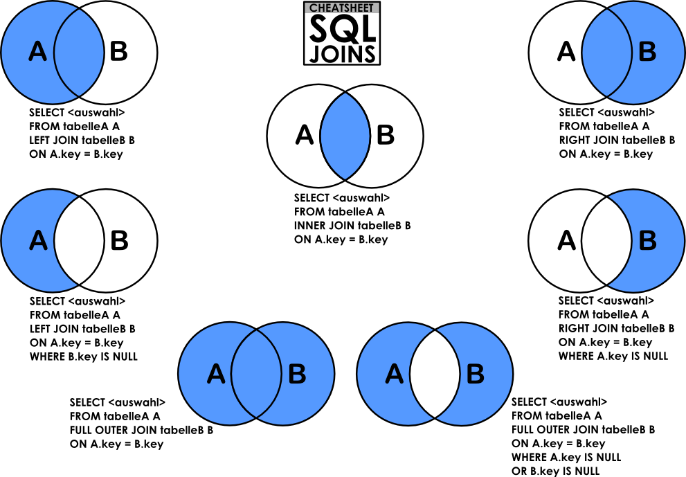
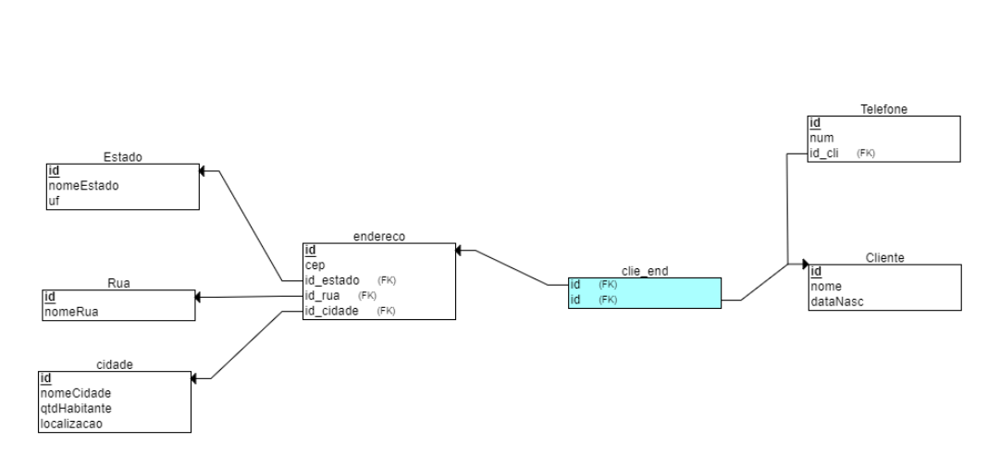

- [DataBase - First SQL](#firstsql) 
- [DataBase - Joins](#joins) 
- [DataBase - MER](#mer) 
- [DataBase - DDL](#ddl) 
- [DataBase - DML](#dml) 
- [DataBase - DQL](#dql) 

### DataBase - First SQL 
~~~
    -- DDL (DELETE TABLE)
    drop table aluno;

    -- CREATE TABLE
    create table aluno (
        id integer PRIMARY KEY,
        nome VARCHAR(50), 
        cpf char(14),   
        id_End INTEGER REFERENCES endereco(id) not null
    ); 

    -- CREATE TABLE
    create TABLE endereco (
        id INTEGER PRIMARY key, 
        rua VARCHAR(35), 
        cidade varchar(35), 
        estado varchar (35)
    );

     -- INSERT VALUES
    insert into endereco values (1, 'rua das palmeiras', 'Blumenau', 'SC')
    insert into endereco values (2, 'Av. Beirra mar Norte', 'Florianópolis', 'SC');

    INSERT into aluno values (1, 'Joao', '009.000.567-12', 1);
    INSERT into aluno values (3, 'Joana', '009.000.567-12', 2);

    -- SHOW TABLE
    select * from endereco; 
    select * from aluno; 

    -- SHOW COLUMNS FROM DIFFERENTS TABLES
    SELECT aluno.id, 
        aluno.nome, 
        aluno.cpf, 
        endereco.id,
        endereco.rua, 
        endereco.cidade,
        endereco.estado
    from aluno, endereco
    where aluno.id_end = endereco.id; 

    -- DISPLAY ONLY ROWS WITH SPECIFIC IDS 
    select * 
    from demo
    where id >= 2 
    and id <= 4;  
~~~

### DataBase - Joins 

### DataBase - MER 

### DataBase - DDL 
~~~
create table estado(
    id int PRIMARY KEY, 
	estado VARCHAR(35), 
	uf char(2)
);

create table cidade(
	id int PRIMARY key, 
	nomeCidade varchar(35) not null,
	qtdHabitantes int,
	localizacao point,
    id_estado int references estado(id) --foreign key
);

create table rua (
	id int PRIMARY KEY, 
	nomeRua VARCHAR(35) not null,
    id_cidade int references cidade(id) --foreign key
);

create table endereco(
	id int primary key, 
	cep char(8), 
    numero int, 
	id_rua int references rua(id) --foreign key
);

create table mae(
	id int PRIMARY key, 
	nome varchar(35) not null, 
	dataNasc date 
);

create table end_mae(
	id_end int,         
	id_mae int,   
	primary key (id_end, id_mae),
	foreign key (id_end) references endereco(id),
	foreign key (id_mae) references mae(id)
);

alter table end_mae add tipo_uso char(4) not null default 'nc';  
alter table end_mae alter column tipo_uso TYPE varchar(15); 

-- Constraints are rules that are enforced on data in a table. It ensures that the values in the tipo_uso column must be one of the specified values: 'Veraneio', 'Fim Semana', or 'Uso Regular'.

alter table end_mae add constraint chk_const_tipo_uso check(tipo_uso in ('Veraneio', 'Fim Semana', 'Uso Regular' ))

--remove constrain
alter table end_mae DROP CONSTRAINT end_mae_pkey; 
 
CREATE TABLE parto(
  id INT,
  data DATE,
  horario time,
  tipo CHAR(1),
  id_mae INT,
  PRIMARY KEY (id),
  FOREIGN KEY (id_mae) REFERENCES mae(id)
);

CREATE TABLE medico(
  id INT,
  nome VARCHAR(35),
  crm VARCHAR(35),
  PRIMARY KEY (id)
);

CREATE TABLE Telefone(
  id INT,
  numTel VARCHAR(35),
  id_medico INT,
  PRIMARY KEY (id),
  FOREIGN KEY (id_medico) REFERENCES medico(id)
);

CREATE TABLE mae_medico(
  id_mae INT,
  id_medico INT,
  FOREIGN KEY (id_mae) REFERENCES mae(id),
  FOREIGN KEY (id_medico) REFERENCES medico(id)
);

CREATE TABLE medico_parto(
  id_parto INT,
  id_medico INT,
  FOREIGN KEY (id_parto) REFERENCES parto(id),
  FOREIGN KEY (id_medico) REFERENCES medico(id)
);

CREATE TABLE especialidade(
  id INT,
  espcialidade VARCHAR(35) NOT NULL,
  PRIMARY KEY (id)
);

CREATE TABLE medico_Especialidade(
  id_especialidade INT,
  id_medico INT,
  FOREIGN KEY (id_especialidade) REFERENCES especialidade(id),
  FOREIGN KEY (id_medico) REFERENCES medico(id)
);

CREATE TABLE bebe(
  id INT, 
  dataNasc DATE,
  pesoNasc FLOAT,
  alturaNasc FLOAT,
  id_mae INT,
  id_parto INT,
  PRIMARY KEY (id),
  FOREIGN KEY (id_mae) REFERENCES mae(id),
  FOREIGN KEY (id_parto) REFERENCES parto(id)
);

CREATE TABLE medico_bebe(
  id_medico INT NOT NULL,
  id_bebe INT NOT NULL,
  FOREIGN KEY (id_medico) REFERENCES medico(id),
  FOREIGN KEY (id_bebe) REFERENCES bebe(id)
);

CREATE TABLE end_bebe(
  id_end INT,
  id_bebe INT,
  FOREIGN KEY (id_end) REFERENCES endereco(id),
  FOREIGN KEY (id_bebe) REFERENCES bebe(id)
);

-- serial increment
create table medicamentos(
	id serial PRIMARY key,
	descricao VARCHAR(20), 
	qdt int
);

-- insert
insert into medicamentos(descricao, qdt) values ('bandagem3', 34);

-- select all table
select * from medicamentos;

-- create table based on another table
create table proprietario_IB as 
  select * from proprietario;

-- index
create index idx_aluguel_valorauguel
on aluguel(valorauguel);
~~~

### DataBase - DML 
~~~
--insert 
insert into cidade values (1, 'Blumenau', 300000, '23.56,12.78'); 
insert into cidade values (2, 'Gaspar', 50000, '23.56,12.78'); 
insert into cidade values (3, 'Pomerode', 30000, '23.56,12.78'); 
insert into cidade values (4, 'Indaial', 100000, '23.56,12.78'); 
insert into cidade values (5, 'Timbó', 70000, '23.56,12.78'); 
insert into cidade values (7, 'Joinville', 650000, '23.56,12.78'); 
 
--select
select * from cidade where id = 1;

--insert 
insert into endereco values (2, '89203077', null, null, 7);
INSERT INTO endereco (id, cep, id_cidade) VALUES (3, '89203098', 5);

--update 
UPDATE endereco
SET id_rua = 2, 
    id_estado = 1
WHERE id_cidade = 3;

--delete 
delete from cidade where id = 2
~~~

### DataBase - DQL 
~~~
-- Select all columns
select * from corretor;

-- Select some columns
select codcorr, nome from corretor; 

-- Alias of column
select codcorr as "Codigo Corretor" from corretor; 

-- Agregattion functions (count, max, min, avg, sum)
select sum(codcorr) as "Qtd Corretores" from corretor; 
select count(*) as "Qtd Corretores" from corretor; 

-- Aritmetic functions
select codalu as "aluguel", (valorauguel * 0.05) as "desconto" from aluguel;

--Concat columns
select 'teste ' || codalu || ' - ' from aluguel; 
select 'insert into aluguel values(' || codalu || ',' || dataalug || ');' from aluguel;

-- Relational operators (=, >,<, >=, <=, <>, like, in, between)
select * from corretor where licenca like '%7'; 
select * from corretor where licenca like 'LC8%';
select * from corretor where licenca like '%C25%'; 
select * from corretor where codcorr in (2,3,4);
select * from corretor where codcorr between 2 and 4;

-- Logic operators (AND, OR, NOT)
select * from aluguel where dataalug > '2020-01-01' and codcorr = 5;
select * from aluguel where dataalug > '2020-01-01' and not codcorr = 5;

-- Ordening
  select * 
    from aluguel 
   where dataalug > '2020-01-01' 
     and not codcorr = 5 
order by codimo desc;

-- Working with multiple tables
select corretor.codcorr, nome, licenca, codalu, dataalug, valorauguel
  from corretor, aluguel 
 where corretor.codcorr = aluguel.codcorr
   and dataalug > '2020-01-01';   
   
select imovel.descricao, 
       aluguel.valorauguel, 
	   imovel.alugado,
	   proprietario.nome,
	   proprietario.telefone
  from imovel, aluguel, proprietario
 where proprietario.codprop = imovel.codprop
   and imovel.codimo = aluguel.codimo;
	   
-- Alias with tables...     
select c.nome as "Nome Corr",
       c.licenca, 
	   a.codalu, 
	   a.codinq,
	   a.codimo,
	   a.codcorr,
	   a.dataalug, 
	   a.datavenc,
	   a.valorauguel
  from corretor c, aluguel a 
  where c.codcorr = a.codcorr
   order by codcorr, dataalug;
 
~~~