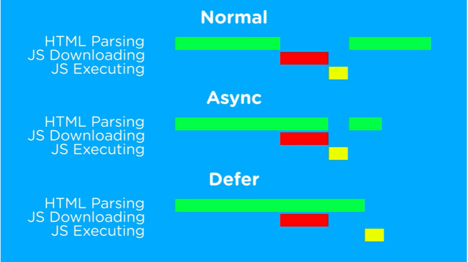

## JavaScript - Logic Programming

- [JS - How to declare variables](#declare)
- [JS - Types of data - Strings, Numbers, Boolean, Object...](#data)
- [JS - Arithmetic operators](#operators)
- [JS - Getting Elements from HTML](#gettingelements)
- [JS - Selection Structures (If/Else and Switch/Case)](#selection)
- [JS - Repeating Structures (while, do/while, for)](#repeating)
- [JS - Arrays - Declaring an Array, Array methods (push( ), pop( ), shift( ), unshift( ), lenght)](#arrays)
- [JS - Functions](#functions)
- [JS - Events](#events)
- [JS - Strings Methods](#stringsmethods)
- [JS - CSS with JavaScript](#csswithjs)
- [JS - Creating Elements with .innerHTML and .write](#innerhtml)
- [JS - Creating Elements with .createElement and .appendChild](#createelement)
- [JS - Object - Structure](#objectstructure)
- [JS - Where To Save Script](#jsfiles)
- [JS - Windows Types of Alerts](#alertstypes)

### JS - How to declare variables 
~~~
    

~~~

### JS - Types of data - Strings, Numbers, Boolean, Object... 
~~~
   

~~~

### JS - Arithmetic operators 
~~~
   

~~~

### JS - Getting Elements from HTML 
~~~
    

~~~

### JS - Selection Structures (If/Else and Switch/Case) 
~~~
   
~~~

### JS - Repeating Structures (while, do/while, for) 
~~~
    
~~~

### JS - Arrays - Declaring an Array, Array methods (push( ), pop( ), shift( ), unshift( ), lenght) 
~~~
    
~~~

### JS - Functions 
~~~
    
~~~

### JS - Events 
~~~
    
~~~

### JS - Strings Methods 
~~~
     
~~~

### JS - CSS with JavaScript 
~~~

   

   
~~~

### JS - Creating Elements with .innerHTML and .write 
~~~

   

~~~

### JS - Creating Elements with .createElement and .appendChild 
~~~

    

~~~

### JS - Object - Structure 
~~~
 
~~~

### JS - Where To Save Script 

### JS - Windows Types of Alerts 
~~~

~~~