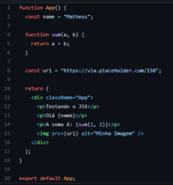
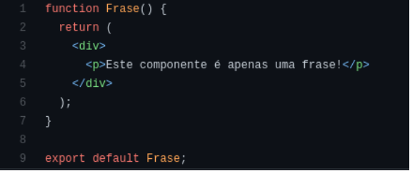
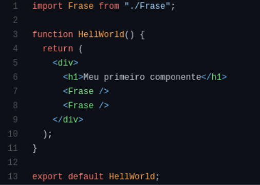
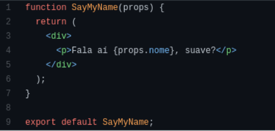
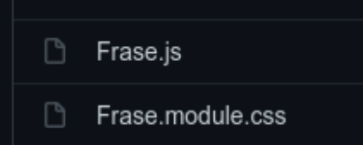
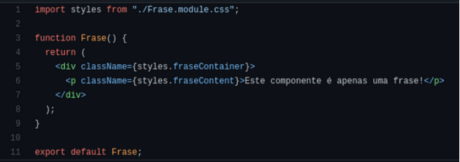
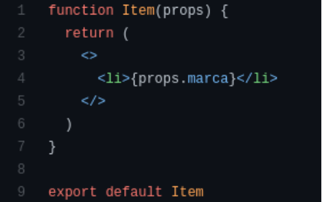
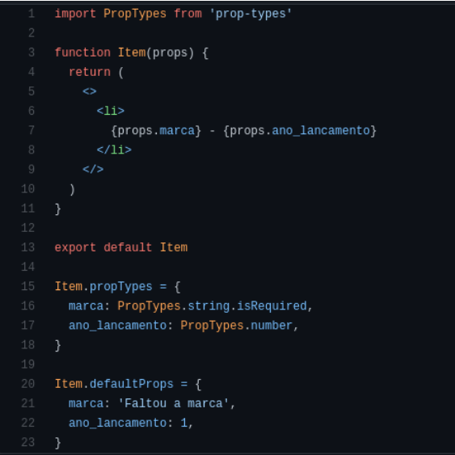
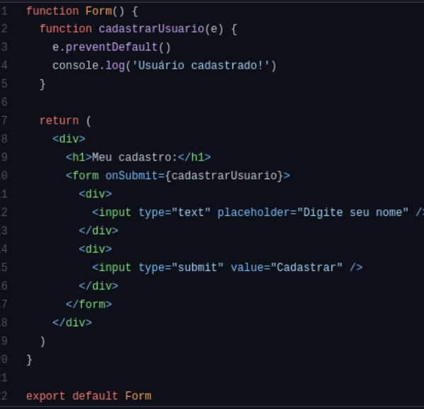

- [React - Introduction](#intro)
- [React - First Project](#firstproject)

# React - Introduction <a id="intro"></a>

- It is a JavaScript library for creating interfaces.
- Used to build Single Page Applications (SPAs).
- Based on components.
- Uses JSX to render HTML.
- Virtual DOM concept.

## Angular vs. React

| **Angular** | **React** |
|:-----------:|:---------:|
| Google      | Facebook  |
| Structural Framework | Library |
| MVC         | ---       |
| Strict Structure | No Structure |
| Larger components | More focused on Components |
| More specific code | More focus on reusability |
| Steeper Learning Curve | Short Learning Curve |
| More robust applications | Recommended for intense dynamic content |
| TypeScript  | JavaScript |
| Uses Dependency Injection | Does not use dependency injection |
| Two-Way Data Binding | One-Way Data Binding |

### Companies

| **Angular** | **React**  |
|:-----------:|:----------:|
| Gmail       | Instagram  |
| Microsoft   | Netflix    |
| Upwork      | Dropbox    |
| Sony        | Uber       |
| Forbes      | Airbnb     |
| PayPal      | Yahoo      |
| GoPro       | Asana      |
| AWS         | Intercom   |

### Glossary
- [React Glossary](https://pt-br.legacy.reactjs.org/docs/glossary.html)

## React Installation

React can be installed in various ways, but currently, the preferred choice is create-react-app.

It's a script that can be executed through npm, creating the basic structure for a React project.

**You can use the following commands:**

```bash
npx create-react-app helloworld
cd helloworld
npm start
```

## JSX

JSX is the primary way to write HTML with React.

JSX is like HTML but within JavaScript code. It allows various actions, such as printing data from variables in our templates. It's also possible to execute JavaScript code, like an "if" statement.

You can write JSX in the App.js file of React or in any component. Here's an example of JSX.



Note that it's very similar to HTML, but we need to avoid some words like `class`, which belongs to JavaScript, so we use `className`.

We can interpolate variables by enclosing them between curly braces `{}`. It's also possible to insert values into tag attributes, just like in HTML.

Find more at: [Introducing JSX](https://legacy.reactjs.org/docs/introducing-jsx.html)

## Components

Components are part of the React architecture. In an application, there can be various components, representing smaller parts of the site in smaller proportions, for example: a navigation bar, product card, or page title. All these cases can be divided into components.

One of the great advantages of components is that they can be reused in various places within the application.

**Example of a Component**



Usually, components are stored in the **components** folder. We need to create a function and export it.

Note that here we also use JSX, which is returned within parentheses since it has more than one line of code.

To use this component, we need to import it into a file. See the example of importation.

**Example of Importation:**



We use the component like a tag, with the syntax `<Frase />`. Note that there is also the closing tag.

The name of the component is reflected by what it was imported as, as seen in the first line of the code.

## PROPS

Props are the data that we pass from the parent component to the child component.

Most of the time, we don't modify this data, meaning we only use it.

It is an extremely used feature in React.



Here, the `SayMyName` component accepts the props, and within it, we use the prop called `nome`. Note that we need to declare it in the function's creation.

Now, see how to pass props to the component that accepts them.


Here, we reuse the `SayMyName` component three times, passing a different name each time.

We saw two features being used:
- Passing props;
- Reusing components;

## Adding CSS

To add CSS to our application, we have access to a feature called CSS Modules.

Simply create a file with the same name as the component where you want to add styles, ending with **module.css**. So if we have a component called `Frase.js`, let's create the file `Frase.module.css`.



In the component, we import our CSS file and access the classes that were defined in it by inserting them into the elements of our component. This is the final implementation.



We import the CSS with the name `styles` (which is a commonly used convention).

We access the classes defined in the CSS as properties of an object.

Now our component has CSS!

## Fragments

Whenever we define a component, we need to return only one element.

Fragments solve this problem, simplifying our HTML.

We can then return a kind of special tag, which allows a component to return two or more elements.

**See the implementation:**



Here, we return only one `<li>` with a fragment that has the following syntax: `<> ... </>`. In other words, we open a fragment tag and then need to close it.

## Prop Types

We can define the type of a prop and also provide default values for it.

This makes our program much more solid, limiting what it accepts for better functioning.

**See the example:**



To define the type, we need to import `prop-types`.

And then apply the types to the properties we want to define.

To set a default value, it is not necessary to import anything, but we need to create the `defaultProps` property and insert the default value for the props we need. This ensures that if no value is passed, the default values are displayed instead of an empty value, which can be interesting in various cases.

## Events

React events are fundamental features for handling user data submissions, such as form submissions.

So, for each action, we have an event (clicks, keystrokes, forms, etc.).

**See an example:**



The submit event triggers a method, i.e., a function, where we can execute code based on the logic of our application.

# React - First Project <a id="firstproject"></a>

```bash
npx create-react-app helloworld
cd helloworld
npm start
```

## Creating components and props

App.js
~~~
import './App.css';
import Card from './components/Card';
import ListaCarros from './components/ListaCarros';
import Pessoa from './components/Pessoa';
import FormUsuario from "./components/FormUsuario"
import FormCliente from './components/FormCliente';
import FormClienteUseState from './components/FormClienteUseState';

function App() {

  function soma(a, b){
    return a + b
  }

  const nome = "Ivan"

  return (
    <div className="App">
        <p>Olá {nome}, Este é seu primeiro REACT!</p>
        <p>A soma de A e B é: {soma(2, 5)}</p>
        <p>Teste</p>
        <Card/>
        <Pessoa nome="Joselito" 
                idade="34"
                cpf="004.005.009-23" 
                foto="https://github.com/Ivan-J-Borchardt/imagens/blob/master/joinha.jpg?raw=true"       
        />
        <Pessoa nome="Joana" 
                idade="23"
                cpf="004.005.222.98" 
                foto="https://github.com/Ivan-J-Borchardt/imagens/blob/master/toquinho.jpg?raw=true"       
        />
        <ListaCarros/>
        <FormUsuario/>
        <FormCliente/>
        <FormClienteUseState/>
    </div>
  );
}

export default App;
~~~

Folder components -> Card.js
~~~
import Mensagem from "./Mensagem"

function Card() {

    const fnUser = "Analista"
    
    return(
        <div>
                
            <p>Sr. Fulando de Tal</p>
            <Mensagem funcao={fnUser}/>    
        </div>
    )

}

export default Card
~~~

Folder components -> Mensagem.js
~~~
function Mensagem(props){

    return(
        <> {/* fragment */} 
            <p>Função do Usuário: {props.funcao}</p>
        </>
    )
}

export default Mensagem
~~~

CSS styles module -> Pessoa.module.css
~~~
.azul{
    color: blue; 
}
~~~

Folder components -> Pessoa.js
~~~
import styles from './Pessoa.module.css'

function Pessoa({nome, idade, cpf, foto}) {

    return(
        <div className={styles.azul}>
            
            <h2>Nome: {nome}</h2>
            <p>Idade: {idade}</p>
            <p>CPF: {cpf}</p>        
        </div>
    )
}

export default Pessoa
~~~

Folder components -> ListaCarros.js
~~~
import ItemLista from "./ItemLista"

function ListaCarros() {
    return(
        <>
            <h1>Lista de Carros</h1>
            <ul>
                <ItemLista modelo="Ford Ka"  ano={2015} />
                <ItemLista modelo="EcoSport" marca="Ford" ano={2020} />
                <ItemLista modelo="Tiguan" marca="Volkswagen" ano={2020} />
                <ItemLista modelo="Fusca" marca="Volkswagen"  />
            </ul>
        </>
    )
}

export default ListaCarros
~~~

Folder components -> ItemLista.js
~~~
import PropTypes from 'prop-types'

    function ItemLista({marca, modelo, ano}) {
        return(
            <li>{marca} - {modelo} - {ano}</li>
        )
    }

    ItemLista.propTypes = {
        marca : PropTypes.string.isRequired, 
        modelo: PropTypes.string,
        ano: PropTypes.number
    }

    ItemLista.defaultProps = {
        marca: 'Inserir Marca', 
        ano: 0
    }

export default ItemLista
~~~

Folder components -> FormUsuario.js
~~~
function FormUsuario() {

    function salvar() {
        console.log("Salvando...:", document.getElementById("idNome").value);
    }

    return(
        <>
            <div>
                <label htmlFor="idNome">Nome:</label>
                <input type="text" id="idNome"/>
            </div>
            <button onClick={salvar} >Salvar</button>
        </>
    )
}

export default FormUsuario
~~~

Folder components -> FormCliente.js
~~~
function FormCliente() {

    function salvarCliente(event) {
        event.preventDefault()
        console.log("Salvando Cliente...", document.getElementById("idNomeCli").value);
    }

    return(
        <div>
            <h1>Cadastro de Cliente</h1>
            <form onSubmit={salvarCliente}>
                <div>
                    <input type="text" id="idNomeCli" placeholder="Nome do Cliente"/>
                </div>
                <div>
                    <input type="submit" value="Salvar"/>
                </div>

            </form>
        </div>
    )
}

export default FormCliente
~~~

Folder components -> FormClienteUseState.js
~~~
import {useState} from 'react'
import Botao from './Botao';

function FormClienteUseState() {

    function salvarCliente(event) {
        event.preventDefault()
        console.log("Nome do Cliente capturado pelo Hook useState:..", nomeCli);

    }

    const [nomeCli, setNomeCli] = useState("Tim Berners-Lee")


    return(
        <div>
            <h1>Cadastro de Cliente usando UseState</h1>
            <form>
                <div>
                    <input 
                        type="text" 
                        id="idNomeCli" 
                        placeholder="Nome do Cliente"
                        value={nomeCli}
                        onChange={function(event){ setNomeCli(event.target.value)}}
                    />
                </div>
                <div>
                    <Botao event={salvarCliente} text="Enviar"/>
                </div>

            </form>
        </div>
    )
    }

export default FormClienteUseState
~~~

Folder components -> Botao.js
~~~
function Botao(props) {
    return(<button onClick={props.event}>{props.text}</button>)
}

export default Botao
~~~